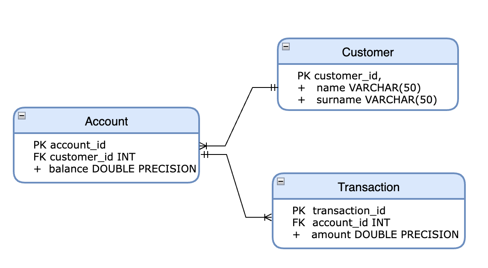

# bh-backend

This project uses Quarkus, the Supersonic Subatomic Java Framework.
If you want to learn more about Quarkus, please visit its website: https://quarkus.io/ .

## Database

### 
For this project we use H2 which is an embedded, open-source, and in-memory database. 
It is a relational database management system written in Java. It is a client/server application. 
It stores data in memory, not persist the data on disk.
here some documentation about [H2](https://www.h2database.com/html/main.html)

### Database  Schema


### Database Configuration
The Database configuration can be found in the application.properties
```
quarkus.datasource.db-kind=h2
quarkus.datasource.jdbc.url=jdbc:h2:mem:default;DB_CLOSE_DELAY=-1;INIT=RUNSCRIPT FROM 'classpath:db_script.sql'
quarkus.hibernate-orm.dialect=org.hibernate.dialect.H2Dialect
quarkus.hibernate-orm.log.sql=true
```

By default, closing the last connection to a database closes the database. For an in-memory database, 
this means the content is lost. To keep the database open, we added **DB_CLOSE_DELAY=-1** to the database URL. 

To initialise the database with the sql script **db_script.sql** we added **INIT=RUNSCRIPT FROM 'classpath:db_script.sql'**
This script create the required tables and insert a few users in the Customer table.

## Running the application in dev mode
You can run your application in dev mode that enables live coding using:

```shell script
mvn clean install
./mvnw compile quarkus:dev
```

> **_NOTE:_**  Quarkus now ships with a Dev UI, which is available in dev mode only at http://localhost:8080/q/dev/.

## Running the application in docker
You have to make sure that the docker daemon is up and running. For that the easiest way is to install
[Docker desktop](https://docs.docker.com/desktop/).

Once the docker deamon is running you can execute the following cmd : 
```shell script
docker login  
docker build -f src/main/docker/Dockerfile.jvm -t bh-backend .
docker run -i --rm -p 8080:8080 bh-backend
```

## Packaging and running the application

The application can be packaged using:

```shell script
./mvnw package
```

It produces the `quarkus-run.jar` file in the `target/quarkus-app/` directory. Be aware that it’s not an _über-jar_ as
the dependencies are copied into the `target/quarkus-app/lib/` directory.

The application is now runnable using `java -jar target/quarkus-app/quarkus-run.jar`.

If you want to build an _über-jar_, execute the following command:

```shell script
./mvnw package -Dquarkus.package.type=uber-jar
```

The application, packaged as an _über-jar_, is now runnable using `java -jar target/*-runner.jar`.

## Creating a native executable

You can create a native executable using:

```shell script
./mvnw package -Pnative
```

Or, if you don't have GraalVM installed, you can run the native executable build in a container using:

```shell script
./mvnw package -Pnative -Dquarkus.native.container-build=true
```

You can then execute your native executable with: `./target/bh-backend-1.0-SNAPSHOT-runner`

If you want to learn more about building native executables, please consult https://quarkus.io/guides/maven-tooling.

## How to use the API
Here are an example of curls commands to tests the 3 endpoints available: 

### Get All Customers

```shell
curl --location --request GET 'http://localhost:8080/customer'
```

### Get Customer by customerID

```shell
curl --location --request GET 'http://localhost:8080/customer/id?customerid=1'
```

### Open a New Account

```shell
curl --location --request POST 'http://localhost:8080/account' \
--header 'Content-Type: application/json' \
--data-raw '{
    "customerID" : 1,
    "initialCredit" : -6
}'
```